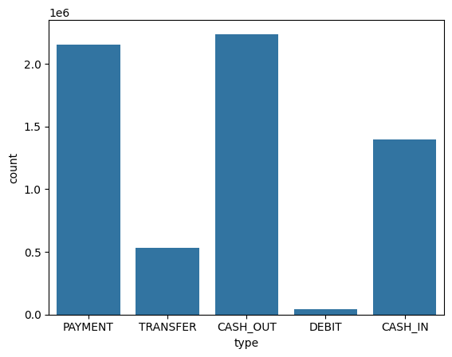
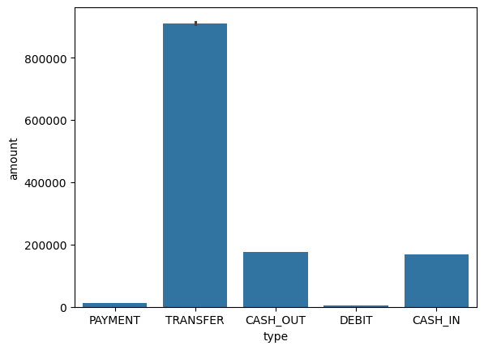
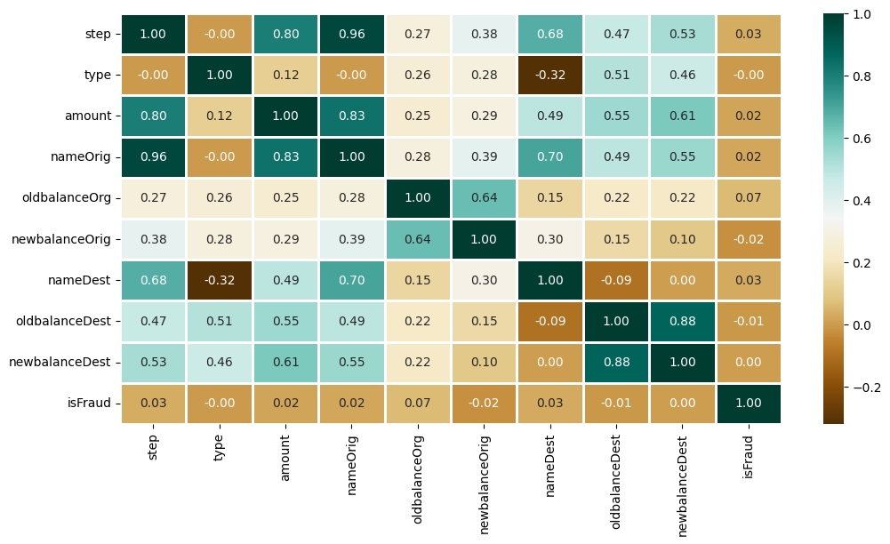
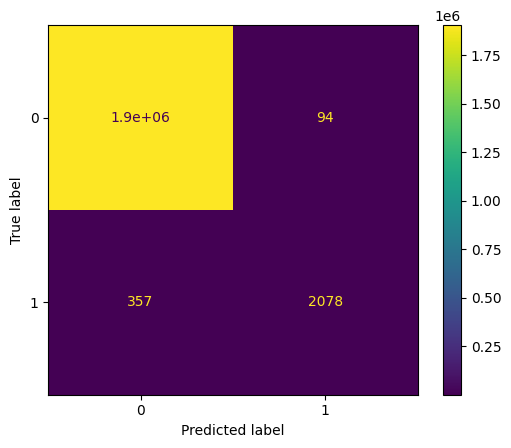

<div align="center">
  
# Online Payment Fraud Detection Pipeline
**A robust Machine Learning pipeline for detecting fraudulent online financial transactions using ensemble models.**

</div>

## Table of Contents
- [Overview](#overview)
- [Dataset Details](#dataset-details)
- [Project Workflow](#project-workflow)
  - [1. Data Exploration & Visualization](#1-data-exploration--visualization)
  - [2. Data Preprocessing & Feature Engineering](#2-data-preprocessing--feature-engineering)
  - [3. Splitting & Scaling (Best Practices)](#3-splitting--scaling-best-practices)
  - [4. Model Training](#4-model-training)
- [Results](#results)
- [Repository Structure](#repository-structure)

---

## Overview
This repository contains a full Machine Learning workflow designed to identify fraudulent online transactions. The pipeline demonstrates extensive exploratory data analysis (EDA), feature engineering via one-hot encoding, and the implementation of various classification algorithms, including Logistic Regression, XGBoost, and Random Forest.

---

## Dataset Details
The dataset (`new_file.csv`) contains historical financial transaction records alongside the target variable `isFraud` (Binary classification: 0 or 1).

**Key Features Include:**
- **Transaction Details:** `step`, `type`, `amount`
- **Origin Account:** `nameOrig`, `oldbalanceOrg`, `newbalanceOrig`
- **Destination Account:** `nameDest`, `oldbalanceDest`, `newbalanceDest`

---

## Project Workflow

### 1. Data Exploration & Visualization
Initial exploratory data analysis uncovers the transaction types that are most common and those that involve the highest transfer amounts.

<div align="center">
  
  <br><em>Figure 1: Transaction Types Distribution</em>
</div>

<br>

<div align="center">
  
  <br><em>Figure 2: Transaction Amounts by Type</em>
</div>

<br>

<div align="center">
  
  <br><em>Figure 3: Feature Correlation Heatmap</em>
</div>


### 2. Data Preprocessing & Feature Engineering
- **Feature Selection:** Removed irrelevant string-based features (`nameOrig`, `nameDest`) to prepare the data for numerical algorithms.
- **One-Hot Encoding:** Transformed the categorical `type` feature into dummy variables using `pd.get_dummies(..., drop_first=True)`.

### 3. Splitting & Scaling (Best Practices)
- **Train-Test Split:** The dataset is split into an 70% training set and a 30% holdout testing set.
- **Feature Scaling:** Continuous variables (`step`, `amount`, `oldbalanceOrg`, `newbalanceOrig`, `oldbalanceDest`, `newbalanceDest`) are normalized using `StandardScaler`.
> **Best Practice Note:** The codebase has been optimized so that scaling is strictly performed *after* the train-test split, fitting the scaler only on the training data. This prevents **Data Leakage**, ensures robust evaluation on unseen data, and drastically improves the convergence time for Logistic Regression.

### 4. Model Training
Three separate models are trained to compare performance:
1. **Logistic Regression**
2. **XGBClassifier (Extreme Gradient Boosting)**
3. **Random Forest Classifier**

```python
from xgboost import XGBClassifier
from sklearn.linear_model import LogisticRegression
from sklearn.ensemble import RandomForestClassifier

models = [
    LogisticRegression(), 
    XGBClassifier(),
    RandomForestClassifier(n_estimators=7, criterion='entropy', random_state=7)
]

for model in models:
    model.fit(X_train, y_train)
```

---

## Results
The trained models successfully identify patterns indicative of fraudulent activity. The models are evaluated on the test set using the ROC-AUC scoring metric, with the ensemble tree-based models (XGBoost, Random Forest) generally outperforming linear models on this highly non-linear dataset.

Below is the Confusion Matrix for the best-performing model (XGBClassifier):

<div align="center">
  
  <br><em>Figure 4: XGBClassifier Confusion Matrix</em>
</div>

---

## Repository Structure

```text
├── Online_Payment_Fraud_Detection.ipynb   # Main Jupyter Notebook
├── Online_Payment_Fraud_Detection.py      # Python Script equivalent
├── new_file.csv                           # Original Dataset
├── plot_0.png - plot_5.png                # Exported Visualizations
└── README.md                              # Project Documentation
```
